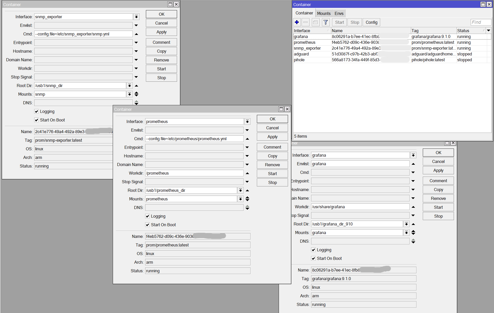

# MikroTik Monitoring with Container feature
Aiming to have a beautiful Grafana Dashboard to monitor a MikroTik device?\
You are in the right place!

Monitoring  MikroTik using 3 Containers (SNMP Exporter + Prometheus + Grafana).\
[MikroTik Container](https://help.mikrotik.com/docs/display/ROS/Container) is available in RouterOS from v7.\
Using it to monitor the MikroTik itself reduce the costs and complexity derived from deploying a new dedicated machine for the same objective.\

[SNMP Exporter](https://hub.docker.com/r/prom/snmp-exporter), [Prometheus](https://hub.docker.com/r/prom/prometheus) and [Grafana](https://hub.docker.com/r/grafana/grafana) are a well known stack of tools that enable to monitor any type of device with appropriate configurations.\ 
In this scenario the metrics are retrieved in real time with SNMP, Prometheus act as timeseries database with query and Grafana had that sweet dashboards.\

In my configuration I have a MikroTik RouterBoard L009UiGS (ARM) with ROS v7.12 but the steps are very general and almost equal for every version.\ 
# Setup steps
First of all Enable SNMP on MikroTik in IP->SNMP, tick the box and leave others as default.\
## 1. MikroTik activate Container feature
First of all we have to activate the *Container* package on MikroTik, to default it is disabled.\
To check if it is also activated in WinBox, open *New Terminal* and run: 
`system/device-mode/pr`\
After the mode (e.g. `mode: enterprise`) should be compare the string `container: yes`\
If you have already activated it, go next to the step 2.\
Else if not you have to **download, install and activate the package**.\

1. **Download**
	- Go to https://mikrotik.com/download/archive
	- Select your ROS version
	- Download the *all_packages* zip of your architecture
		- You can see your architecture in WinBox `System->Resources`

2. **Install**
	- From the downloaded zip extract file *"container-X.Y.npk"* and upload it inside *Files* in MikroTik (you can Drag and Drop the file inside WinBox)
	- Now *System->Reboot* the MikroTik in order to install the package
		- After that you can already see *Container* features on the left bar of WinBox but you still cannot use it until you activate it.   

3. **Activate**
	- In WinBox, open *New Terminal* and run:
		- `system/device-mode/update container=yes`
	- After that you have to shutdown the MikroTik as explained in the CLI, turning power off or pressing button of MikroTik device, otherwise the activation is stopped.
	- If the activation worked after the boot you can check running in New Terminal `system/device-mode/pr` again as above.

## 2. MikroTik VETH interfaces configuration
Note: After each following step press before *Apply* and then *OK* buttons.
1. Go to *Bridge* and in *Bridge* tab create a *New Interface*
	- Name: docker
		- Leave the rest of fields as default
2. Go to *IP->Addresses* add a *New Address*
	- Address: 192.168.50.1/24
	- Network: 192.168.50.0
	- Interface select "docker"
3. Go to *IP->Firewall* in *NAT* tab create a *New NAT Rule*
	- Chain select "srcnat"
	- Src. Address: 192.168.50.0/24
		- (This is the *Addresses* of the *Bridge* "docker")
	- Go to *Action* tab and as *Action* select "masquerade"
4. Go to *Interfaces* and in *VETH* tab add 3 *Interfaces* (*Copy* the first to speed up the process)
	1. *New Interface* for **Grafana**
		- Name: grafana
		- Address: 192.168.50.100/24
		- Gateway: 192.168.50.1
	2. *New Interface* for **SNMP Exporter**
		- Name: snmp_exporter
		- Address: 192.168.50.101/24
		- Gateway: 192.168.50.1
	3. *New Interface* for **Prometehus**
		- Name: prometheus
		- Address: 192.168.50.102/24
		- Gateway: 192.168.50.1
5. Go to *Bridge* and in *Ports* tab **create a *New Bridge Port* for each *VETH interface*** (grafana, snmp_exporter, prometheus) created above and select *"docker"* as Bridge.
	- (In order to Bridge all the interfaces on the same subnet LAN)

## 3. Configuration files
Prepare configuration files for containers.\
1. Download the 3 folders (grafana, prometheus and snmp) from the repository.
2. Modify files as follow:
	- grafana/provisioning/datasource.yml
		- url: http://192.168.50.102:9090 
		- (or your prometheus VETH IP)
	- prometheus/prometheus.yml
		- in *job_name MikroTik* change targets to your Mikrotik ip (MikroTik IP where SNMP is enabled)
		- in *replacement* put the snmp_exporter VETH IP: 192.168.50.101:9116
3. Finally load the 3 folders in MikroTik ***Files***.

## 4. MikroTik Containers configuration
First of all we have to to set the Environment variables and Mount path to volume for our Containers. 
1. Go to *Container* and in **Envs** tab.\
	The Envs interest only the grafana container, we define this 3 envs for it:
	- Name: `grafana`, Key: `GF_SECURITY_ADMIN_USE`, Value: `admin`
	- Name: `grafana`, Key: `GF_SECURITY_ADMIN_PASSWORD`, Value: `mikrotik`
	- Name: `grafana`, Key: `GF_SECURITY_SIGN_UP`, Value: `false`

2. Go to *Container* and in **Mounts** tab.\
	Note: all *src path* is at your choice e.g. path to an external usb drive attached to MikroTik.
	There are one Mount for each container:
	- Name: `grafana`, Src: `/usb1/grafana/provisioning`, Dst: `/etc/grafana/provisioning/`
	- Name: `prometheus`, Src: `/usb1/prometheus`, Dst: `/etc/prometheus`
	- Name: `snmp`, Src: `/usb1/snmp`, Dst: `/etc/snmp_exporter`

3. Finally, go to *Container* and in **Container** tab press *Config* button
	- Registry URL: https://registry-1.docker.io
	- Tmp Dir: /pull
		- (This path is at your choice e.g. path to an external usb drive attached to MikroTik)

4. Now in tab Container we can create a container for each VETH created before.\
	Note: in each container the `Root Dir` path field is at your choice (e.g. path to an external usb drive attached to MikroTik e.g. `/usb1/grafana_dir`).\
	**After you fill out the fields of each container press *Apply* and wait for download/extracting of the container until in status appear *"stopped"* (if it appear is all OK) then go to create the next container, else if appear status: "*error*", *Copy* the  container, delete the old, and re-try to *Apply*.**
	- New Container for Grafana
		- Remote Image: grafana/grafana:9.1.0
		- Interface select *"grafana"*
		- Envslist: grafana
		- Mounts select "*grafana*"
		- Root Dir: /usb1/grafana_dir
		- (Tick *Logging* and *Start On Boot* boxes if you want)
	- New Container for Prometheus
		- Remote Image: prom/prometheus:latest
		- Interface select *"prometheus"*
		- Cmd: --config.file=/etc/prometheus/prometheus.yml
		- Root Dir: /usb1/prometheus_dir
		- Mounts select *"prometheus"*
		- (Tick *Logging* and *Start On Boot* boxes if you want)
	- New Container for SNMP Exporter
		- Remote Image: prom/snmp-exporter:latest
		- Interface select *"snmp_exporter"*
		- Cmd: --config.file=/etc/snmp_exporter/snmp.yml
		- Root Dir: /usb1/snmp_dir
		- Mounts select *"snmp"*
		- (Tick *Logging* and *Start On Boot* boxes if you want)

## 5. Start Container
After all you can Start and Stop the container using the respective button.\
Start all containers in order (SNMP Exporter, Prometheus and Grafana) and enjoy.\

### Link 
If you configured the VETH interfaces and other as above, then:
- Grafana: [192.168.50.100:3000](192.168.50.100:3000) 
	- admin:mikrotik
- Prometheus: [192.168.50.102:9090](192.168.50.102:9090) 
- SNMP Exporter: [192.168.50.101:9116](192.168.50.101:9116)

Obv, you should assure that they are reachable from your host.  
# Possible issues
- In some version for ARM Grafana show "No data" to interface in and out:
	- Rapid solution: edit the dashboard, edit the query, change $scrap_intervall to 30s or others. (after you modify the ether1 all other will change automatically)
	- Solution: from grafana 9.1.0 the problem was resolved
- Container store is created only the first time that the Apply button is pressed 
	- Possible issue: mikrotik container create a directory instead of container store
	- If you create or remove container with same Root Dir of another the conflicts is coming to you! 
	- Be careful before removing container, when you do it the relative Root Dir is eliminated (even container store)
	- Be careful before press Apply button delete all the container that you want to eliminate
- When Start the container check in Files if the Root Dir is created as "container store" type, if not there was a problem (starting the container will fail with "execve: No such file or directory"), copy the container setup and change the Root Dir until the container is started correctly

Thanks [@IgorKha](https://github.com/IgorKha/) for [configuration files](https://github.com/IgorKha/Grafana-Mikrotik/) and [Dashboard](https://grafana.com/grafana/dashboards/14420-mikrotik-monitoring/).

Special thanks to my MikroTik teacher @rolando.

